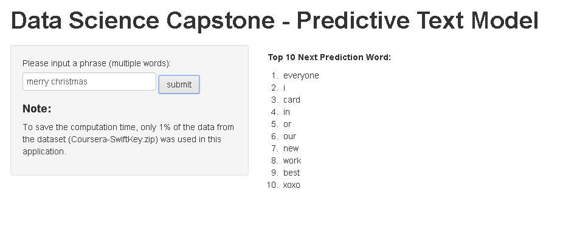

Data Science Capstone - Predictive Text Model
========================================================
author: Toby H.W. Lam
date: 26 Nov 2014
width: 1920
height: 1080

Background
========================================================

- In this project, we are required to use the text data, which are collected from publicly available sources by a web crawler [1], to create a predictive text model

- The Coursera-SwiftKey.zip can be downloaded from the Coursera page. There are three files: 
  - __en_US.blogs.txt__,  
  - __en_US.news.txt__, 
  - __en_US.twitter.txt__
  

  
Text Predictive Model Algorithm
========================================================
## Prediction Algorithm
1. Preprocessing the text (e.g. filter non-English words, symbols)
2. Tokenization
3. Prepare unigram, bigram and trigram from the data
4. Count the occurrences of each unique unigram, bigram and trigram
5. Get the text phrase from the user
6. Extract the last two tokens (e.g. prev1, prev2) from the phrase. _If the phrase is not long enough, extract the last token (i.e. prev2)_
7. Calculate the probabilty of all the possible match (more detail in below) 
8. Return the top 10 predicted words

## More Details about Calculating the Probabilty
- To take the diversity of histories into account, I adopted Modified Kneser-Ney Smoothing for calculating the probability [2].

1. Check if there is any match in __Trigram__ (i.e. prev1, prev2 -> matchWord). __If cannot find any match, move to step 3.__
2. Return the top 10 predicted word by using the calculated probability. Done!
3. [Back-off] Check if there is any match in __Bigram__ (i.e. prev2 -> matchWord). __If cannot find any match, move to step 5.__
4. Return the top 10 predicted word by using the calculated probability. Done!
5. [Back-off] Return the top 10 most frequently used __Unigram__. Done!

Shiny App - Predictive Text Model
=========================================================
- The application can be accessed from https://tobylam.shinyapps.io/DataSciCapstone/
- Screenshot:

- Basic usage of the application:
  1. Input phrase in the text field
  2. Press the __Submit__ button
  3. __Please wait for a while... (be patient)__
  4. The top 10 next prediction words will be listed on the right hand side

Conclusion
=========================================================
- At the time creating the slide, I only used 1% of the data for developing the prediction model.
  - Smaller data size -> quick response
- I will check if I can updating the application by using the larger data set.
- The milestone report and the source code can be downloaded from: 
 https://github.com/2blam/DataSciCapstone

## Reference:

[1] - http://www.corpora.heliohost.org/aboutcorpus.html

[2] P. Koehn, Statisitcal Machine Translation, pp.201 - 203, Cambridge, 2010
